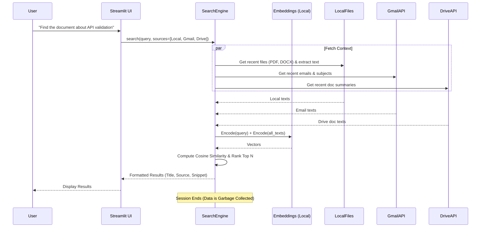

# MemorySearch - Implementation Plan & Architecture

MemorySearch is a lightweight, privacy-first AI tool designed to help users find documents and emails based on semantic intent instead of exact keywords. It processes data strictly in-memory during the query session and drops all context afterward.

## 1. System Architecture

## 2. Implementation Plan

### Phase 1: Core Setup & Embedding Engine
- Set up a virtual environment and install dependencies (`streamlit`, `sentence-transformers`, `scikit-learn`).
- Implement the `SemanticSearchEngine` class that uses a fast, lightweight local embedding model (e.g., `all-MiniLM-L6-v2` via HuggingFace's sentence-transformers).
- Ensure the model is loaded into memory once and texts are processed in batches purely in memory.

### Phase 2: Source Integrations
- **Local Files**: Implement a directory scanner that recursively finds `.txt`, `.pdf`, and `.docx` files. Extract a brief amount of text (first few pages or a summary) using `PyPDF2` and `python-docx`.
- **Gmail API**: Set up Google OAuth 2.0. Use the Gmail API to fetch the latest N emails (metadata and snippet). 
- **Google Drive API**: Use the Drive API to list recent files and their short descriptions or extract readable text bounds.

### Phase 3: The Search Pipeline
- When a user submits a query:
  1. Concurrently fetch data from all enabled sources.
  2. Map fetched items to a standard schema `{'id', 'title', 'source', 'text', 'metadata'}`.
  3. Encode the fetched text.
  4. Perform semantic similarity (e.g., using `cosine_similarity`).
  5. Sort results and yield the top 5-10 matches.

### Phase 4: UI Development (Streamlit)
- Create a clean, single-page UI.
- Add toggle switches for filtering sources (Local, Gmail, Drive).
- Add the search bar.
- Display results elegantly with cards containing the Match Score, Source Badge, Title, and Snippet.

### Phase 5: Privacy & Performance Hardening
- Verify that no data is written to disk (everything in Python lists/dicts).
- Restrict fetch counts (e.g., last 100 emails) to keep in-memory computation fast (< 2 seconds).

## 3. Setup Instructions (for this starter code)
1. Navigate to this directory: `cd "c:\Users\Manashjyoti Barman\Desktop\MemorySearch"`
2. Create virtual env: `python -m venv venv`
3. Activate it: `venv\Scripts\activate`
4. Install reqs: `pip install -r requirements.txt`
5. Run the app: `streamlit run app.py`

*Note: For Gmail and Drive, you will need to create a project in the Google Cloud Console, enable the APIs, and retrieve `credentials.json`.*
